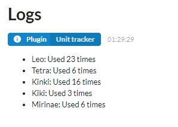
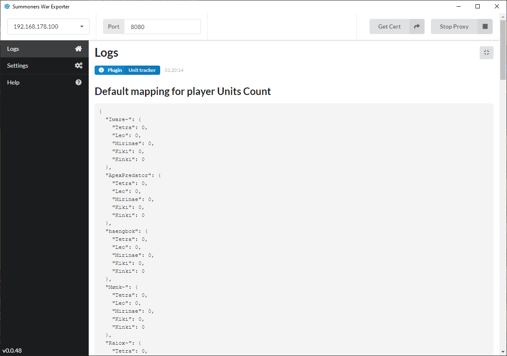
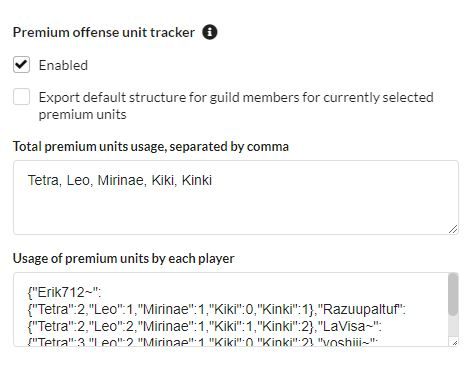
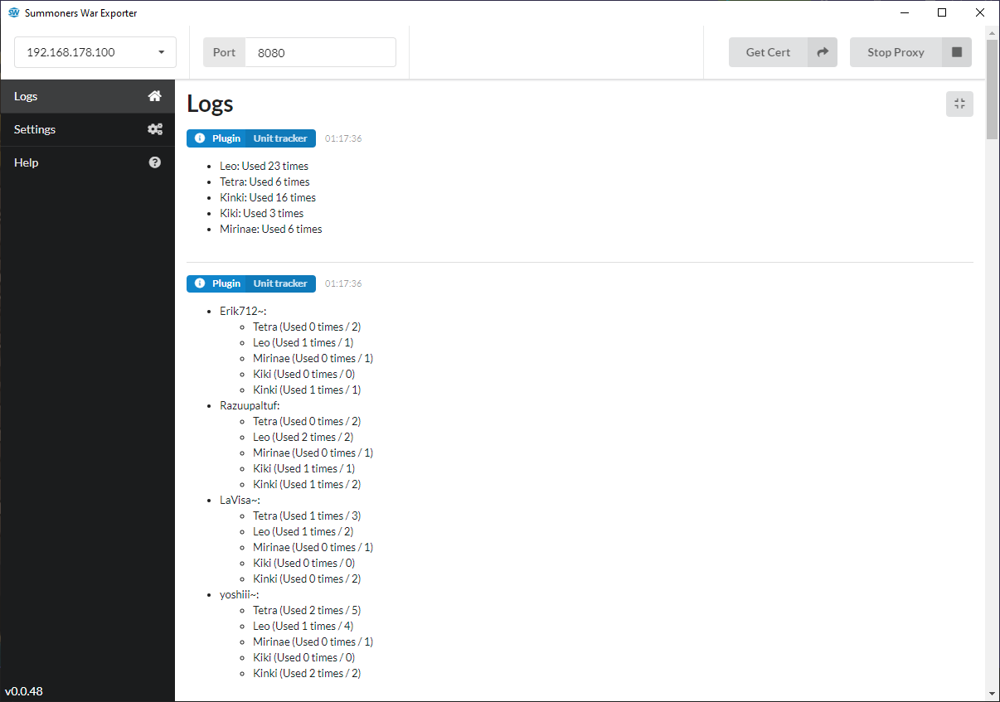

# SW-siege-used-unit-tracker
SWEX Proxy plugin to track the number of used premium units of each member

## How to use

Move the premium_unit_tracker.js file to your **"plugins"** folder in your Summoners War Exporter Files. The path to the Summoners War Exporter Files folder can be found at the top of your Settings in the Summoners War Exporter. If no "plugins" folder exists yet, create one. 

The next time you start your Summoners War Exporter, you should find a new section **"Premium offense unit tracker"** within your Settings. By default this plugin is enabled, you can disable it by unticking the "Enabled" checkbox. Next you can enter the names of the units you want to track per player separated by comma into the **"Premium units to track, separated by comma"** textarea. E.g. "Leo, Tetra, Kinki, Kiki, Mirinae". The next time you go to the siege section ingame, you can click on the "Info" button to show the latest siege attacks for the current or last siege. With this setup only, you should see how often each premium unit was used in the current or last siege. The result in your Summoners War Exporter Logs should look something like this:



To track each members individual usage, you have to create a JSON structure that contains the number of dupes of each premium unit per member. This data has to be added manually. An example JSON would look like this:

```
{
    "LaVisa~": {
        "Tetra": 5,
        "Leo": 2,
        "Mirinae": 2,
        "Kiki": 0,
        "Kinki": 1
    },
    "yoshiii~": {
        "Tetra": 5,
        "Leo": 4,
        "Mirinae": 1,
        "Kiki": 0,
        "Kinki": 2
    }
}
```

To help create such a structure, you can enable the **"Export default structure for guild members for currently selected premium units"** checkbox in the Settings tab. When this is enabled, you can open the Guild tab from the Community button. This will create a default structure with each member and the units listed in the **"Premium units to track, separated by comma"** textarea. The Summoners War Exporter Logs will display the following:



The whole structure can be copied and adjusted to the real values. Once that is done, you can copy the modified JSON into the **"Usage of premium units by each player"** textarea in the Settings tab. The final settings should look similiar to the following:



Once that is done as well, the final result when checking the Attack logs of the current or last siege should look like this:

